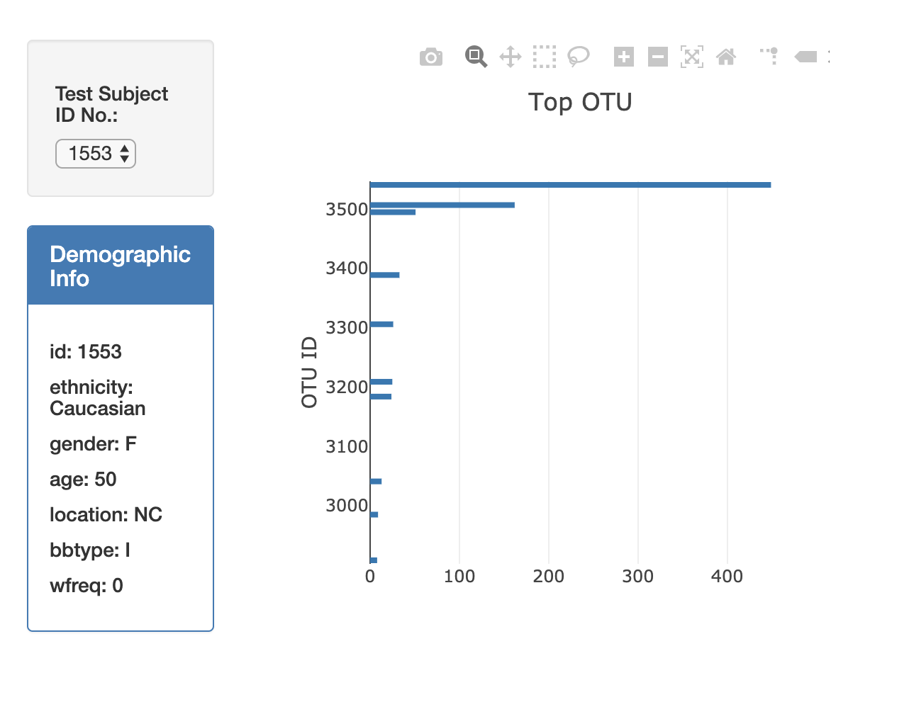

# Plot.ly Homework - Belly Button Biodiversity #
Interactive dashboard created using Plotly to explore the [Belly Button Biodiversity DataSet](http://www.http://robdunnlab.com/projects/belly-button-biodiversity/ "Belly Button Biodiversity DataSet"). The dataset reveals that a small handful of microbial species (also called operational taxonomic units, or OTUs, in the study) were present in more than 70% of people, while the rest were relatively rare.

#### Data Visualizations ####
* Demographic info
* Horizontal bar chart displays the top 10 OTU IDs for the individual chosen from the dropdown menu
* Bubble Chart displays each sample

